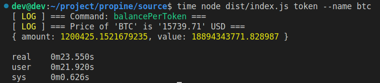
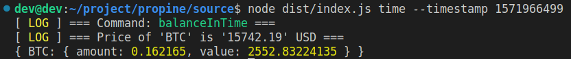

# Crypto Assests handler

## About project

Confronting vast files in term of size, as you can't handle the matter, could depict of nun in the Hell. The moment which system have faced with *MEMORY LEAK* and some associated trouble that directly point to memory usage difficulties.

Here we should supres of heavy computing by using one of built-in features that frankly in the development ecosystem, all known NODE as mentions feature and this is **"STREAM"**.

"Duplex", "Readable" and other type of this mechanism, open new floor to developers handling easy and well-versed all cpu intensive computations and indentical processing.

In this project, all endeavor focuses on implementing some best practices that overall first grade teams try to observe. Here we can name some of these opt:

* Using **TYPESCRIPT**
* Using well-known and tested libraray like **arg**, **lodash** and ...
* Using OOP and class in core of project
* Empowering program by utlizing **stream** library
* Using **coingecko** SDK for gathering upcoming market price datas


## Config

```bash
vi src/config/app.config.ts
```

## Build

```bash
npm run build
```

## Development

```bash
npm run start
```

## Usage

### 1) Given no parameters, return the latest portfolio value per token in USD

```bash
node dist/index.js
```


### 2) Given a token, return the latest portfolio value for that token in USD

```bash
node dist/index.js token --name btc
```


### 3) Given a date, return the portfolio value per token in USD on that date

```bash
node dist/index.js time --timestamp 1571966499
```


### 4) Given a date and a token, return the portfolio value of that token in USD on that date

```bash
node dist/index.js filter --name btc --timestamp 1571966499
```
