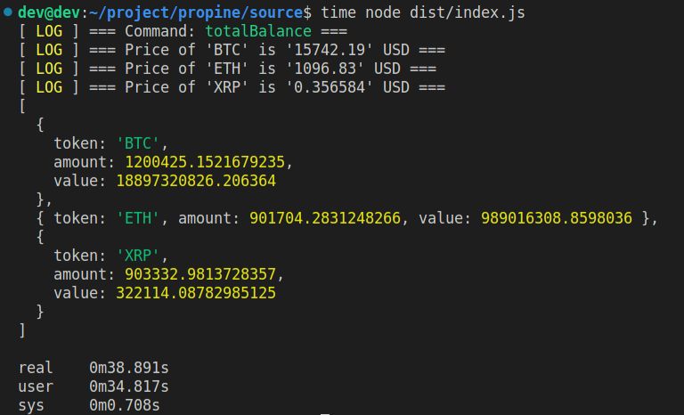

# Crypto Assests handler

## Config


```bash
vi src/config/app.config.ts
```

## Build

```bash
npm run build
```

## Development

```bash
npm run start
```

## Usage

```bash
node dist/index.js balance
```

